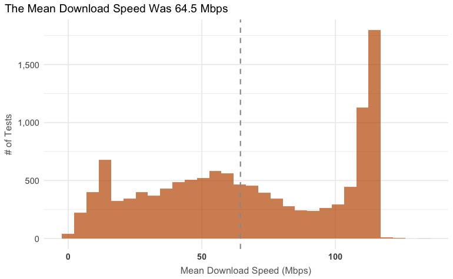
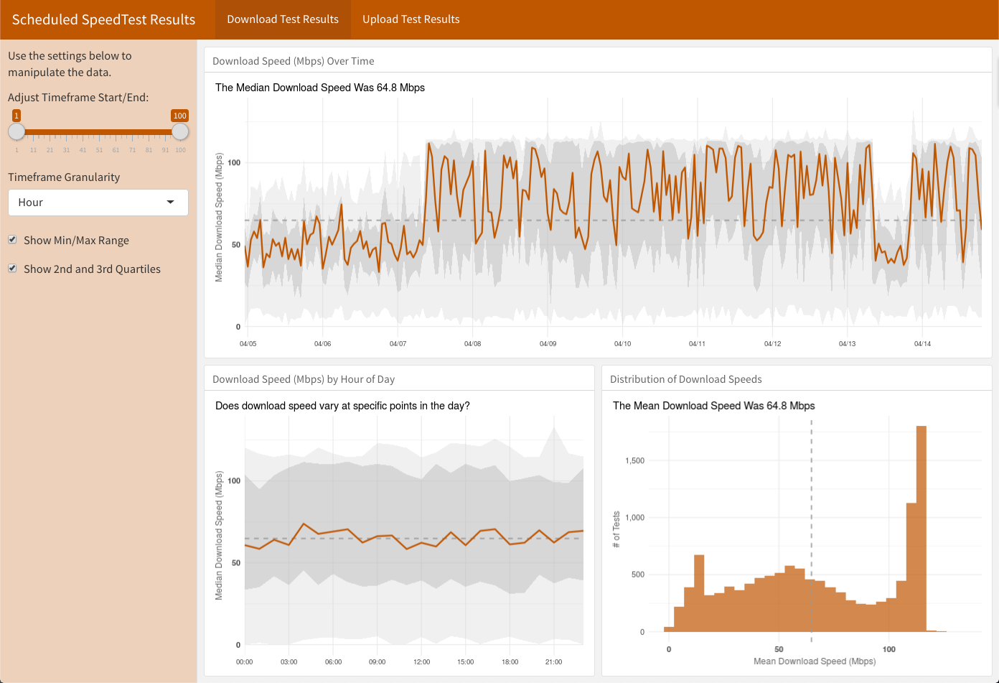
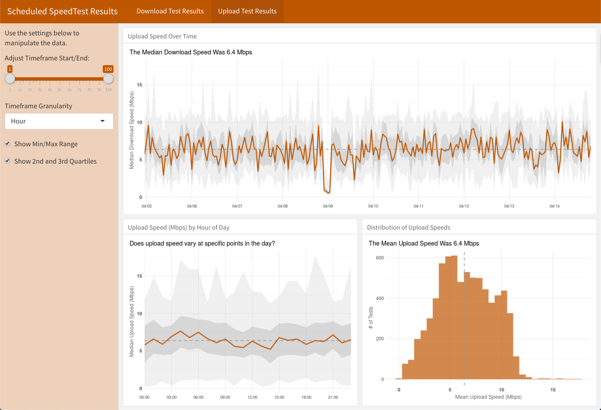

# Scheduling, Logging, and Visualizing SpeedTest Data

It's all well and good to go to https://www.speedtest.net/ and run a SpeedTest. But, that's just one server at one point in time. 

This project has two parts and is intended to track bandwidth speed over time by repeatedly running a speed test and then visualizing the results. This is useful to get a read on what a specific device's actual download and upload speeds are and how much they fluctuate.

There are two parts to this:

* `run-speedtest.R` -- a script that can be scheduled to run on any schedule and record the results of the speed tests (upload and download) to a Google Sheet
* `visualize-speedtest.Rmd` (RNotebook) and/or `visualize-speedtest-flex.Rmd` -- an RNotebook and/or a Shiny app that will read the results from that Google Sheet and provide plots of the recorded bandwidth over time.

The code to run the speed tests is largely based on what is posted at https://github.com/hrbrmstr/speedtest.

## Requirements

In addition to the packages used (as commented in the `run-speedtest.R` file, they are not all on CRAN as of this writing), a Google Sheet needs to be created with two tabs:

* **Download Data** -- this is where the results of the download speed tests will be stored and read
* **Upload Data** -- this is where the results of the upload speed tests will be stored and read

The ID for that Google Sheet will need to be recorded (see the [googlesheets4 documentation](https://googlesheets4.tidyverse.org/) for details). The "visualize" notebook and Shiny app assume that the Google Sheet has been made public (view only / available to anyone with the link) because, well, this seems like particularly non-sensitive data, and it makes for being able to read the data without having to jump through any auth hoops.

Because it's horrible form to store such an ID in public code, both of the files above read that value from an environment variable called `SPEEDTEST_GSHEET`.

You can create the same variable by opening your `.Renviron` file and adding a line to it:

`SPEEDTEST_GSHEET = "[the ID for your Google Sheet]"`

## Scheduling the Tests to Run

Once `run-speedtest.R` is configured and working, it can be scheduled using the `cronR` package on the Mac or using Task Scheduler on Windows. The schedule can be set up for any frequency. I set it up for hourly, but it could be daily or weekly or even be changed over time.

This does simply build a data set stored in Google Sheets that grows indefinitely over time. The larger the Google Sheet, the longer it takes the RNotebook to run or the Shiny app to load. There are two settings in `run-speedtest.R` to limit the growth of this data:

* `num_servers` -- this controls how many tests are run; technically, it controls how many different servers the standard set of SpeedTest tests get run on. If you just run SpeedTest from [speedtest.net](https://www.speedtest.net/), the system picks the "best" server and just runs the test on that. This script lets you specify how many servers to run the tests on just to get a broader read on your device's bandwidth.

* `smaller_file` -- this is a simple TRUE/FALSE. If this is set to `TRUE`, then the script removes a number of columns from the SpeedTest data before pushing the results to the Google Sheet. This cuts the size of the dataset by ~2/3.

## Output - RNotebook

The output of the `visualize-speedtest.Rmd` file will include both time-series charts and histograms of the recorded data.

The time-series plots look something like the following:

The histograms look something like the following:

## Output - Shiny

The Shiny app is more interactive and allows subsetting the data using a simple slider. And, it supports some simple adjustments to the visualization: turning on/off the quartile bands.

It also includes a plot by hour-of-day (my son theorized that bandwidth may vary based on peak usage times, similar to electricity).

## Features to Be Added

The following features need to be added:

* Graceful handling for if the Google Sheet is not set up with the proper tabs

