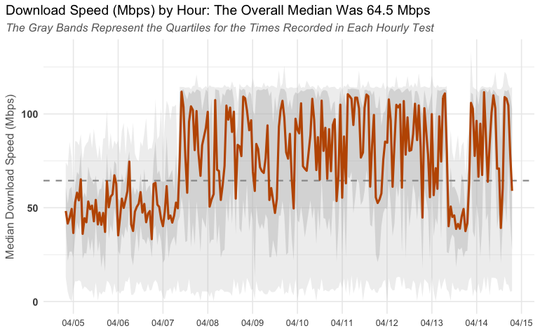
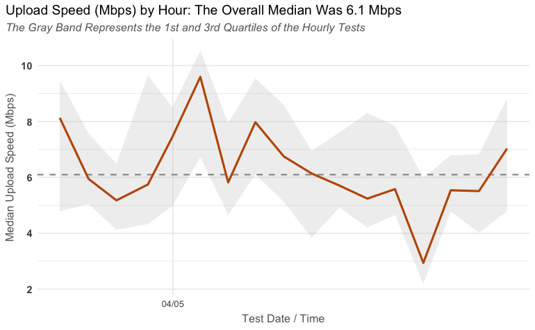

# Scheduling, Logging, and Visualizing SpeedTest Data

It's all well and good to go to https://www.speedtest.net/ and run a SpeedTest. But, that's just one server at one point in time. 

This project has two parts and is intended to track bandwidth speed over time by repeatedly running a speed test and then visualizing the results.

There are two parts to this:

* `run-speedtest.R` -- a script that can be scheduled to run on any schedule and record the results of the speed tests (upload and download) to a Google Sheet
* `visualize-speedtest.Rmd` -- an RNotebook (for now) that will read the results from that Google Sheet and provide plots of the recorded bandwidth over time.

The code to run the speed tests is largely based on what is posted at https://github.com/hrbrmstr/speedtest.

## Requirements

In addition to the packages used (as commented in the `run-speedtest` file, they are not all on CRAN as of this writing), a Google Sheet needs to be created with two tabs:

* **Download Data** -- this is where the results of the download speed tests will be stored and read
* **Upload Data** -- this is where the results of the upload speed tests will be stored and read

The ID for that Google Sheet will need to be recorded (see the [googlesheets4 documentation](https://googlesheets4.tidyverse.org/) for details.)

Because it's horrible form to store such an ID in public code, both of the files above read that value from an environment variable called `SPEEDTEST_GSHEET`.

You can create the same variable by opening your `.Renviron` file and adding a line to it:

`SPEEDTEST_GSHEET = "[the ID for your Google Sheet]"`

## Output

The output of the `visualize-speedtest.Rmd` file will include two charts that look something like the following:

## Features to Be Added

The following features need to be added:

* Graceful handling for if the Google Sheet is not set up with the proper tabs
* Logic for the plots that vary the x-axis markers based on how many days of data are included (if a month or more of data is included, then set the breaks to be weekly rather than daily)
* A Shiny app that will do the work of `visualize-speedtest.Rmd` so the user can check their results without launching R.